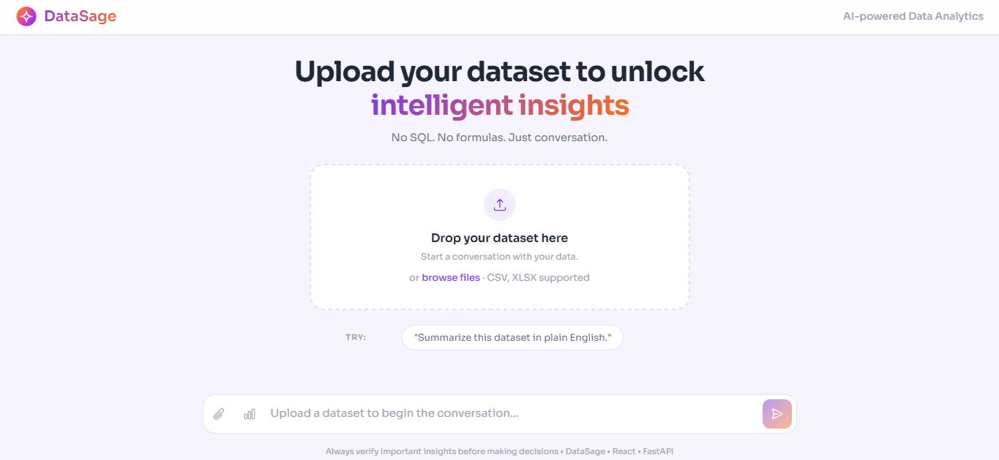

# ✨ DataSage

### Ask questions in plain English. Get deterministic answers — not AI guesses.

**Python computes. AI explains.**

DataSage is an AI-assisted analytics platform that lets users upload CSV datasets and explore them using natural language.

Unlike analytics tools that rely on Large Language Models to generate numerical answers, DataSage converts questions into structured analytical operations and executes them using **Python and Pandas**. AI is introduced only when interpretation is required — after the result has already been computed.

<p align="center">
  
</p>

<p align="center">
  <a href="https://datasage-blush.vercel.app"><strong>Live Application</strong></a>
  &nbsp;&nbsp;•&nbsp;&nbsp;
  <a href="https://datasage-api-cyfu.onrender.com/docs"><strong>API Documentation</strong></a>
  &nbsp;&nbsp;•&nbsp;&nbsp;
  <a href="https://datasage-api-cyfu.onrender.com"><strong>Backend API</strong></a>
</p>

> The backend is hosted on Render's free tier and may take around 30–60 seconds to wake after a period of inactivity.

---

## Why DataSage?

Most AI analytics systems can send analytical questions directly to an LLM. This makes natural-language interaction easy, but it can also make numerical results harder to trust and reproduce.

DataSage separates **computation from interpretation**.

```text
Natural Language Question
          ↓
    Query Understanding
          ↓
 Deterministic Analytics
     (Python + Pandas)
          ↓
     Verified Result
          ↓
   Optional AI Insight
```

If Python can compute something, DataSage doesn't ask AI to calculate it.

AI is instead used to explain verified results, answer contextual follow-ups, and help users understand their dataset.

---

## What Can DataSage Do?

Upload a CSV and ask questions such as:

```text
average transaction amount

average transaction amount by category

show rows where city is delhi

average transaction amount where city is delhi

top 5 categories by transaction amount

which city has the highest average transaction amount?
```

DataSage currently supports:

| Capability | Examples |
|---|---|
| Aggregation | Mean, Sum, Count, Min, Max |
| Filtering | Numeric, categorical and boolean filters |
| Grouping | Average revenue by city |
| Ranking | Top 5 categories by sales |
| Row retrieval | Show records matching conditions |
| Visualization | Automatic bar charts |
| Dataset exploration | Describe this dataset |
| AI insights | Explain verified analytical results |
| Follow-ups | Why is this the highest? |

The same query engine works across different dataset structures without requiring a predefined schema.

---

## Context-Aware Analysis

DataSage maintains the latest successful analytical result within each session.

For example:

```text
User
average transaction amount by category

DataSage
Home Appliances     5727.05
Fashion             5370.31
Toys                5296.96
Electronics         4931.48
Sports              4477.63

User
why is home appliances highest?
```

The follow-up is routed to the AI insight layer along with the **verified analytical result**.

The AI can interpret what the result suggests, while distinguishing between what the data establishes and what would require further investigation.

It never needs to recalculate the underlying numbers.

---

## Architecture

DataSage separates natural-language understanding, deterministic computation, and generative reasoning into independent layers.

```text
                         User Question
                               │
                               ▼
                          Chat Router
                               │
              ┌────────────────┼────────────────┐
              │                │                │
              ▼                ▼                ▼
          Analytics         Dataset         Contextual
           Request        Description         Insight
              │                                  ▲
              ▼                                  │
      Query Understanding                        │
              │                                  │
       ┌──────┼────────┐                         │
       ▼      ▼        ▼                         │
   Filters  Grouping  Ranking                    │
       └──────┬────────┘                         │
              ▼                                  │
          Query Plan                             │
              │                                  │
              ▼                                  │
      Analytics Engine                           │
      (Python + Pandas)                          │
              │                                  │
              ▼                                  │
       Verified Result                           │
              │                                  │
       ┌──────┼────────┐                         │
       ▼      ▼        ▼                         │
      KPI   Table     Chart                      │
              │                                  │
              ▼                                  │
         Query Context ──────────────────────────┘
                                                 │
                                                 ▼
                                           Gemini API
                                                 │
                                                 ▼
                                         Grounded Insight
```

A conversational request is routed into one of three paths:

- **Analytics** — deterministic computation
- **Dataset Description** — understanding and exploring the uploaded dataset
- **Insight** — interpretation of an existing verified result

Unknown analytical requests are not silently handed to the AI layer.

---

## Analytical Reliability

DataSage was validated across structurally different datasets covering sales, healthcare, viewer engagement, and botanical observations.

Three independent test layers are used:

| Test Suite | Result | Purpose |
|---|---:|---|
| Regression Suite | **98 / 98** | Natural-language query coverage |
| Golden Correctness | **15 / 15** | Results verified against independent Pandas calculations |
| Conversation QA | **11 / 11** | Routing, follow-ups, context and session isolation |

**All supported production test gates passed with zero failures.**

This distinction matters: regression tests verify that queries execute correctly, while golden tests independently verify that the numerical answers themselves are correct.

---

## Production

DataSage is deployed as two independently hosted services:

```text
                     User
                       │
                       ▼
              React + Vite Frontend
                    Vercel
                       │
                       ▼
                 FastAPI Backend
                     Render
                       │
              ┌────────┴────────┐
              ▼                 ▼
       Pandas Analytics      Gemini API
           Engine           Insight Layer
```

| Layer | Technology |
|---|---|
| Frontend | React, Vite |
| Visualization | Recharts |
| Backend | FastAPI |
| Analytics | Pandas, NumPy |
| AI | Google Gemini |
| Frontend Hosting | Vercel |
| Backend Hosting | Render |

Production URLs and API credentials are configured through environment variables and secrets are never committed to the repository.

---

## Project Structure

```text
DataSage/
│
├── backend/
│   ├── api/                 # API routes
│   ├── core/                # Analytics & AI orchestration
│   ├── models/              # Internal data models
│   ├── query/               # Natural-language query pipeline
│   ├── storage/             # Session management
│   ├── tests/               # Regression & correctness suites
│   ├── utils/
│   ├── app.py
│   └── requirements.txt
│
├── frontend/
│   ├── src/
│   │   ├── components/
│   │   ├── services/
│   │   ├── styles/
│   │   └── App.jsx
│   └── package.json
│
├── docs/
│   └── images/
│
├── LICENSE
└── README.md
```

---

## Run Locally

### Backend

```bash
git clone <repository-url>
cd dataSage/backend

python -m venv venv
```

Activate the environment:

```bash
# Windows
venv\Scripts\activate

# macOS / Linux
source venv/bin/activate
```

Install dependencies and configure the environment:

```bash
pip install -r requirements.txt
```

Create `backend/.env`:

```env
GEMINI_API_KEY=your_api_key
GEMINI_MODEL=your_gemini_model
```

Start the API:

```bash
uvicorn app:app --reload
```

The API will run at `http://127.0.0.1:8000`.

### Frontend

```bash
cd frontend
npm install
```

Create `frontend/.env`:

```env
VITE_API_URL=http://127.0.0.1:8000
```

Start the development server:

```bash
npm run dev
```

The frontend will normally run at `http://localhost:5173`.

---

## Design Principles

DataSage is built around three rules:

**1. Python computes.**  
Numerical answers come from deterministic analytical code.

**2. AI explains.**  
Generative AI interprets verified results rather than generating the calculations.

**3. Uncertainty stays visible.**  
If the data does not establish why something happened, DataSage should say so instead of presenting speculation as fact.

---

## Vision

DataSage is not intended to be another chatbot wrapped around a spreadsheet.

It explores a more reliable architecture for AI-assisted analytics — one where deterministic computation and generative reasoning have clearly separated responsibilities.

> **Use AI where reasoning adds value. Use deterministic systems where correctness matters.**

---

## Author

**Raksha Sinha**

Built to explore how deterministic analytics and selective AI reasoning can work together to create trustworthy data-analysis systems.

---

## License

Licensed under the [MIT License](LICENSE).